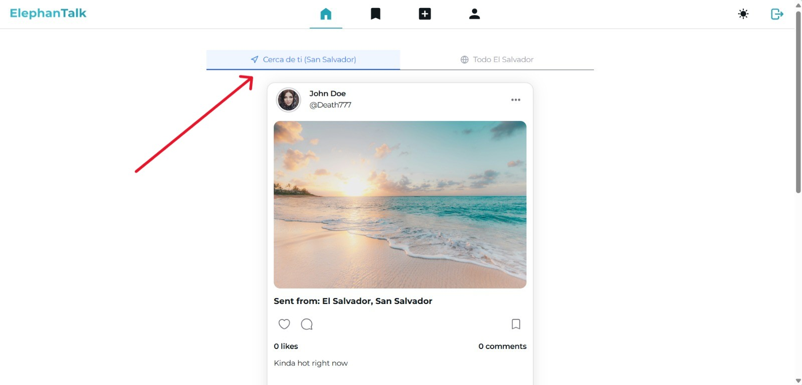
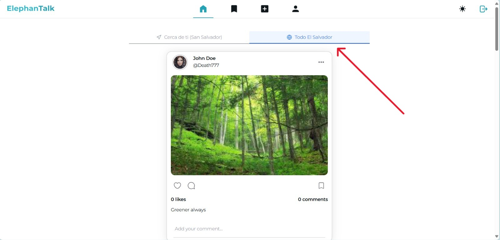
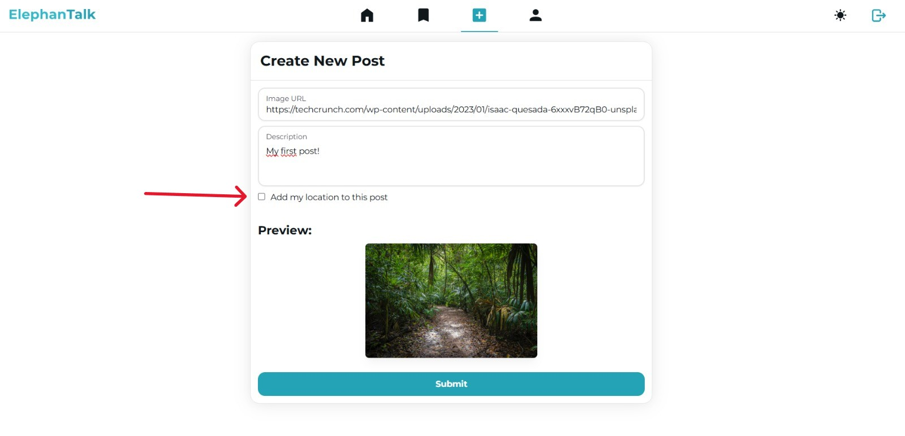
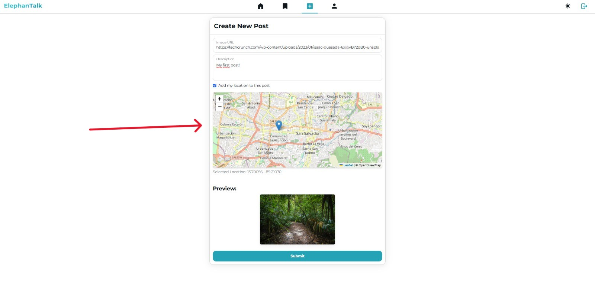

# Manuales de Usuario

Los manuales de usuario detallados están disponibles en el repositorio principal del proyecto.

## Enlace a los manuales originales

📖 [Manuales de usuario originales](https://github.com/kevocodes/ElephanTalk/tree/main/Documents)

## Contenido de los manuales

Los manuales incluyen guías paso a paso para:

- **Registro e inicio de sesión**
- **Creación y gestión de posts** 
- **Sistema de likes y comentarios**
- **Reportar contenido inapropiado**
- **Navegación por la interfaz**

## Geolocalización

La versión trabajada en este proyecto incluye servicios de geolocalización. Es importante mencionar que agregar la ubicación a un post es totalmente opcional. Esta sección **no se encuentra en el manual original**, aquí se explicará los detalles de su funcionamiento, los cambios realizados a la interfaz de usuario y cómo usar las nuevas características.

### Frontend

La interfaz ha recibido una mejora para dale la bienvenida a la geolocalización de los posts!

**Separación de posts**

La nueva interfaz introduce una barra superior que tiene secciones opciones:

- Cerca de ti ("Tu ciudad"): En esta sección encontrarás todos los posts que fueron publicados en tu ciudad.

- Todo El Salvador: En esta sección se encuentran todos los posts que han sido publicados en El Salvador, incluyendo los posts que no han agregado su ubicación.

**Creando un post con geolocalización**

- La interfaz para crear posts ha recibido un pequeño cambio para permitir agregar la ubicación. Para crear un post con geolocalización tenemos que marcar un checkbox llamado **Add my location to this post**:

> **Nota:** Cuando el checkbox sea marcado, es posible que tu navegador te muestre una opción para dar permiso de acceso a tu ubicación, debes aceptar y dar permiso para que la aplicación pueda acceder a ella y agregarla al post.

- Luego de marcar el checkbox, se abrira un pequeño mapa para poder elegir la ubicación que desees, sin embargo, la ubicación marcada por defecto será tu ubicación actual detectada:

> **Nota:** Es posible que ell navegagor tarde unos segundos en detectar tu ubicación actual. 

---

## Audiencia objetivo

Los manuales están diseñados para:

- Estudiantes de informática y áreas afines
- Nuevos usuarios de la plataforma
- Administradores y moderadores

---

**¿Necesitas ayuda adicional?** Si los manuales no responden tu pregunta, puedes contactar al equipo de desarrollo a través de los repositorios del proyecto.